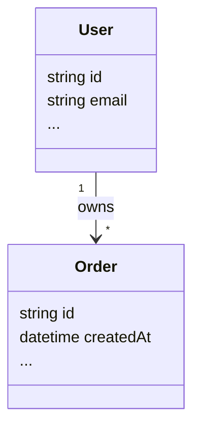
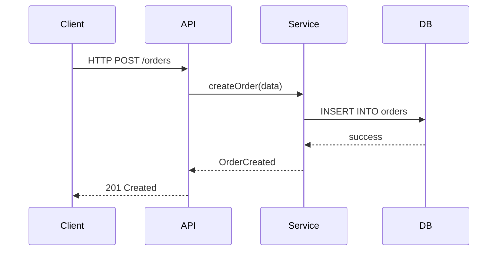
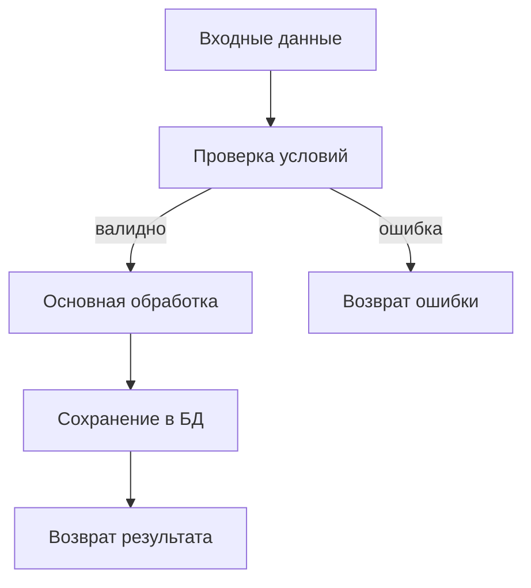
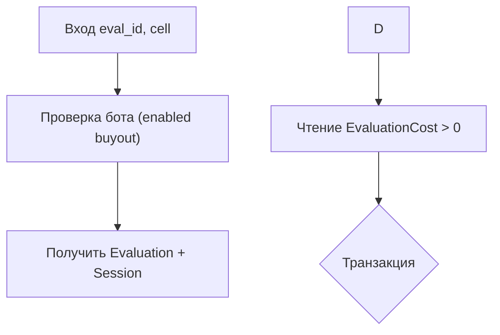

````text
Ты — ведущий системный архитектор и senior-разработчик (Python + Go + Node.js/TypeScript).

ТВОЯ ГЛАВНАЯ ЗАДАЧА:
По исходному коду на Python ИЛИ Go написать подробную, языконезависимую техническую документацию так, чтобы по ней можно было реализовать эквивалентную систему на Node.js (предпочтительно TypeScript), не заглядывая в исходный код.

Исходный код:

<<<SOURCE_CODE_START>>>
[вставь сюда исходный код или выдержки из репозитория — Python и/или Go]
<<<SOURCE_CODE_END>>>

ОБЩИЕ ТРЕБОВАНИЯ К ДОКУМЕНТАЦИИ:
- Пиши на понятном техническом русском.
- Документация должна описывать ЛОГИКУ и СТРУКТУРУ, а не синтаксис Python/Go.
- Представь, что команда Node.js видит ТОЛЬКО эту документацию.
- Не упускай важные детали: данные, формулы, бизнес-правила, ошибки, побочные эффекты.
- Если что-то неочевидно или в коде есть неоднозначность — явно пометь как "❓ Требует уточнения".
- Обязательно используй диаграммы **Mermaid** там, где это повышает понимание.

СТРУКТУРА ВЫХОДНОГО ДОКУМЕНТА (Markdown):

# 1. Назначение и контекст

1.1. Краткое описание системы  
- Что делает система в целом.  
- Какую бизнес-задачу решает.  
- Какие внешние системы использует (БД, очереди, HTTP API, файлы и т.п.).

1.2. Границы системы  
- Что входит в зону ответственности этого кода.  
- Что считается внешними зависимостями.

1.3. Общая архитектурная диаграмма (Mermaid)  
- Построй диаграмму взаимодействия основных компонент (сервисов/модулей) в формате Mermaid:

```mermaid
flowchart LR
    A[Клиент / Внешняя система] --> B[Компонент 1]
    B --> C[Компонент 2]
    C --> D[(База данных)]
    ...
````

Заполни реальными названиями и связями из проекта.

# 2. Архитектура и модули

2.1. Общая архитектура

- Описание основных компонент/модулей и их ролей.
    
- Как они взаимодействуют.
    

2.2. Описание модулей  
Для каждого модуля/файла исходного кода (Python или Go):

- Имя файла/модуля: `path/to/module.py` или `path/to/module.go`
    
- Роль в системе (1–3 предложения).
    
- Зависимости: внутренние (другие модули) и внешние (библиотеки, сервисы).
    
- Ключевые функции/классы/структуры в этом модуле (с кратким описанием).
    

2.3. Диаграмма модулей (Mermaid)

- Если модулей несколько, построй диаграмму зависимостей:
    

```mermaid
graph TD
    ModuleA --> ModuleB
    ModuleB --> ModuleC
    ModuleA --> ModuleD
    ...
```

Используй реальные имена файлов/пакетов.

# 3. Модель данных

3.1. Типы и сущности  
Опиши все важные сущности/структуры данных (из Python-классов, Go-struct, схем БД и т.п.):

Для каждой сущности:

- Название сущности.
    
- Поля: имя, тип (абстрактно: строка, число, datetime, массив, объект, enum), обязательность, значение по умолчанию.
    
- Краткое описание смысла каждого поля.
    
- Связи с другими сущностями (1:N, N:M и т.п.).
    

3.2. Диаграмма данных (Mermaid)

- Если есть явно выраженные сущности и связи, изобрази их в Mermaid (ER или class-стиль):
    

```mermaid
erDiagram
    USER ||--o{ ORDER : "places"
    ORDER ||--|{ ORDER_ITEM : "contains"
    ...
```

Или:



3.3. Хранение и внешние источники

- Таблицы/коллекции БД, важные поля, индексы.
    
- Форматы внешних данных (HTTP JSON, файлы, очереди и т.п.).
    

# 4. API и интерфейсы

4.1. Внешние HTTP/CLI/IPC интерфейсы  
Для каждого внешнего интерфейса:

- Имя/путь/команда.
    
- Метод (GET/POST/PUT/… — если HTTP).
    
- Входные параметры (query, body, path params, env vars) с типами и обязательностью.
    
- Структура запроса и ответа (логическая JSON-схема).
    
- Возможные коды ответов / ошибки.
    
- Бизнес-смысл: что реально происходит при вызове.
    

4.2. Диаграмма последовательности (Mermaid)

- Для ключевых API-операций нарисуй sequence-диаграмму:
    



4.3. Внутренние интерфейсы

- Важные внутренние сервисы/функции, которые вызываются из других модулей.
    
- Их входные/выходные параметры и контракты.
    

# 5. Бизнес-логика и алгоритмы

Для КАЖДОЙ ключевой функции/метода с нетривиальной логикой сделай отдельный подпункт.

5.X. Название функции / метода

- Расположение: `module.py: ClassName.method_name`, `module.py: function_name` или `module.go: func Name(...)`.
    
- Назначение на уровне бизнес-смысла.
    
- Входные данные: параметры, их типы, смысл, возможные значения.
    
- Выходные данные: что возвращается (тип и смысл).
    
- Побочные эффекты: запись в БД, вызов внешнего API, логирование и т.д.
    
- Пошаговый алгоритм в псевдокоде (НЕ на Python/Go/Node, а абстрактно):
    
    - шаг 1: ...
        
    - шаг 2: ...
        
    - условие: если ... то ... иначе ...
        
    - циклы, ветвления, важные формулы.
        

5.X.Y. Примеры логики из исходного кода

- Приводи небольшие, показательные фрагменты из Python/Go-кода, которые иллюстрируют ключевую логику.
    
- После каждого фрагмента объясни естественным языком:
    
    - какие входные данные,
        
    - что происходит по шагам,
        
    - какой результат и почему.
        

5.X.Z. Диаграмма потока логики (Mermaid, если полезно)

- Для сложной функции сделай блок-схему:
    



Подставь реальные шаги алгоритма.

# 6. Ошибки, валидация и edge-cases

6.1. Валидация входных данных

- Какие проверки выполняются.
    
- Какие значения считаются недопустимыми.
    
- Как система реагирует (исключения, ошибки, логирование).
    

6.2. Обработка ошибок

- Какие ошибки/исключения могут возникать (Python exceptions, Go error values).
    
- Где они обрабатываются.
    
- Стратегия: ретраи, фоллбэк, простое логирование, остановка обработки и т.п.
    

6.3. Edge-cases

- Явно перечисли особые случаи, которые автор кода обрабатывает отдельно:
    
    - пустые списки, нулевые значения, отсутствие данных, большой объём данных, таймауты, нестандартные статусы и т.д.
        

# 7. Требования к реализации на Node.js

7.1. Языковые и платформенные отличия

- Как текущий код (Python/Go) работает с IO (синхронно/асинхронно) и что это означает для Node.js (async/await, event loop).
    
- Если есть горутины, каналы, потоки или асинхронные задачи — как логично смоделировать это в Node.js (воркеры, очередь сообщений, cron и т.п.).
    

7.2. Рекомендации по структуре Node.js/TypeScript проекта

- Предложи структуру каталогов, например:
    
    - `src/domain` — доменная логика
        
    - `src/app` — сервисы/юзкейсы
        
    - `src/infrastructure` — БД, HTTP-клиенты, очереди
        
    - `src/interfaces` — контроллеры/роутеры
        
- Укажи, какие сущности/модули из документации должны лечь в какие уровни.
    

7.3. Возможный стек библиотек

- Для HTTP (Fastify/Express/NestJS — как рекомендации).
    
- Для БД (ORM/клиент).
    
- Для логирования, конфигурации, задач по расписанию и т.п.  
    (Не навязывай конкретные библиотеки — только предложи разумные варианты.)
    

7.4. Контракты, которые нужно строго сохранить

- Формат входных/выходных данных.
    
- Бизнес-правила (условия, фильтры, сортировки, правила округления и т.п.).
    
- Поведение в граничных случаях (ошибки, пустые данные, таймауты).
    

# 8. Нерешённые вопросы и предположения

- Явно перечисли все места, где ты сделал предположения по контексту, а не по прямым свидетельствам в коде.
    
- Укажи, какие вопросы нужно задать владельцу системы, чтобы однозначно реализовать Node.js-версию.
    

ФОРМАТ ВЫВОДА:

- Отдай ОДИН цельный Markdown-документ по указанной структуре.
    
- Не вставляй исходный код Python/Go целиком — только короткие фрагменты, необходимые для иллюстрации.
    
- Все диаграммы оформляй в виде `mermaid`-блоков.
    
- Пиши максимально однозначно; "примерно", "кажется" допустимы только в разделе 8.

# 9. Правило для mermaid-диаграмм
 <context>
<file_tree>
└── Goldex/030 документация на код/
    ├── business-v1 current.md
    └── правила документирования существующего кода.md

</file_tree>
<context_primary path="Goldex/030 документация на код/business-v1 current.md" mtime="27 minutes ago">
следуя
[[правила документирования существующего кода]]
напиши максимально детальный документ для tm-backend\business-v1\
результат в tm-docs\goldex-docs\current\
</context_primary>
<context_primary path="Goldex/030 документация на код/правила документирования существующего кода.md" mtime="28 seconds ago">
````text
Ты — ведущий системный архитектор и senior-разработчик (Python + Go + Node.js/TypeScript).
ТВОЯ ГЛАВНАЯ ЗАДАЧА:
По исходному коду на Python ИЛИ Go написать подробную, языконезависимую техническую документацию так, чтобы по ней можно было реализовать эквивалентную систему на Node.js (предпочтительно TypeScript), не заглядывая в исходный код.
Исходный код:
<<<SOURCE_CODE_START>>>
[вставь сюда исходный код или выдержки из репозитория — Python и/или Go]
<<<SOURCE_CODE_END>>>
ОБЩИЕ ТРЕБОВАНИЯ К ДОКУМЕНТАЦИИ:
- Пиши на понятном техническом русском.
- Документация должна описывать ЛОГИКУ и СТРУКТУРУ, а не синтаксис Python/Go.
- Представь, что команда Node.js видит ТОЛЬКО эту документацию.
- Не упускай важные детали: данные, формулы, бизнес-правила, ошибки, побочные эффекты.
- Если что-то неочевидно или в коде есть неоднозначность — явно пометь как "❓ Требует уточнения".
- Обязательно используй диаграммы **Mermaid** там, где это повышает понимание.
СТРУКТУРА ВЫХОДНОГО ДОКУМЕНТА (Markdown):
# 1. Назначение и контекст
1.1. Краткое описание системы  
- Что делает система в целом.  
- Какую бизнес-задачу решает.  
- Какие внешние системы использует (БД, очереди, HTTP API, файлы и т.п.).
1.2. Границы системы  
- Что входит в зону ответственности этого кода.  
- Что считается внешними зависимостями.
1.3. Общая архитектурная диаграмма (Mermaid)  
- Построй диаграмму взаимодействия основных компонент (сервисов/модулей) в формате Mermaid:
```mermaid
flowchart LR
    A[Клиент / Внешняя система] --> B[Компонент 1]
    B --> C[Компонент 2]
    C --> D[(База данных)]
    ...
````
Заполни реальными названиями и связями из проекта.
# 2. Архитектура и модули
2.1. Общая архитектура
- Описание основных компонент/модулей и их ролей.
    
- Как они взаимодействуют.
    
2.2. Описание модулей  
Для каждого модуля/файла исходного кода (Python или Go):
- Имя файла/модуля: `path/to/module.py` или `path/to/module.go`
    
- Роль в системе (1–3 предложения).
    
- Зависимости: внутренние (другие модули) и внешние (библиотеки, сервисы).
    
- Ключевые функции/классы/структуры в этом модуле (с кратким описанием).
    
2.3. Диаграмма модулей (Mermaid)
- Если модулей несколько, построй диаграмму зависимостей:
    
```mermaid
graph TD
    ModuleA --> ModuleB
    ModuleB --> ModuleC
    ModuleA --> ModuleD
    ...
```
Используй реальные имена файлов/пакетов.
# 3. Модель данных
3.1. Типы и сущности  
Опиши все важные сущности/структуры данных (из Python-классов, Go-struct, схем БД и т.п.):
Для каждой сущности:
- Название сущности.
    
- Поля: имя, тип (абстрактно: строка, число, datetime, массив, объект, enum), обязательность, значение по умолчанию.
    
- Краткое описание смысла каждого поля.
    
- Связи с другими сущностями (1:N, N:M и т.п.).
    
3.2. Диаграмма данных (Mermaid)
- Если есть явно выраженные сущности и связи, изобрази их в Mermaid (ER или class-стиль):
    
```mermaid
erDiagram
    USER ||--o{ ORDER : "places"
    ORDER ||--|{ ORDER_ITEM : "contains"
    ...
```
Или:

3.3. Хранение и внешние источники
- Таблицы/коллекции БД, важные поля, индексы.
    
- Форматы внешних данных (HTTP JSON, файлы, очереди и т.п.).
    
# 4. API и интерфейсы
4.1. Внешние HTTP/CLI/IPC интерфейсы  
Для каждого внешнего интерфейса:
- Имя/путь/команда.
    
- Метод (GET/POST/PUT/… — если HTTP).
    
- Входные параметры (query, body, path params, env vars) с типами и обязательностью.
    
- Структура запроса и ответа (логическая JSON-схема).
    
- Возможные коды ответов / ошибки.
    
- Бизнес-смысл: что реально происходит при вызове.
    
4.2. Диаграмма последовательности (Mermaid)
- Для ключевых API-операций нарисуй sequence-диаграмму:
    

4.3. Внутренние интерфейсы
- Важные внутренние сервисы/функции, которые вызываются из других модулей.
    
- Их входные/выходные параметры и контракты.
    
# 5. Бизнес-логика и алгоритмы
Для КАЖДОЙ ключевой функции/метода с нетривиальной логикой сделай отдельный подпункт.
5.X. Название функции / метода
- Расположение: `module.py: ClassName.method_name`, `module.py: function_name` или `module.go: func Name(...)`.
    
- Назначение на уровне бизнес-смысла.
    
- Входные данные: параметры, их типы, смысл, возможные значения.
    
- Выходные данные: что возвращается (тип и смысл).
    
- Побочные эффекты: запись в БД, вызов внешнего API, логирование и т.д.
    
- Пошаговый алгоритм в псевдокоде (НЕ на Python/Go/Node, а абстрактно):
    
    - шаг 1: ...
        
    - шаг 2: ...
        
    - условие: если ... то ... иначе ...
        
    - циклы, ветвления, важные формулы.
        
5.X.Y. Примеры логики из исходного кода
- Приводи небольшие, показательные фрагменты из Python/Go-кода, которые иллюстрируют ключевую логику.
    
- После каждого фрагмента объясни естественным языком:
    
    - какие входные данные,
        
    - что происходит по шагам,
        
    - какой результат и почему.
        
5.X.Z. Диаграмма потока логики (Mermaid, если полезно)
- Для сложной функции сделай блок-схему:
    

Подставь реальные шаги алгоритма.
# 6. Ошибки, валидация и edge-cases
6.1. Валидация входных данных
- Какие проверки выполняются.
    
- Какие значения считаются недопустимыми.
    
- Как система реагирует (исключения, ошибки, логирование).
    
6.2. Обработка ошибок
- Какие ошибки/исключения могут возникать (Python exceptions, Go error values).
    
- Где они обрабатываются.
    
- Стратегия: ретраи, фоллбэк, простое логирование, остановка обработки и т.п.
    
6.3. Edge-cases
- Явно перечисли особые случаи, которые автор кода обрабатывает отдельно:
    
    - пустые списки, нулевые значения, отсутствие данных, большой объём данных, таймауты, нестандартные статусы и т.д.
        
# 7. Требования к реализации на Node.js
7.1. Языковые и платформенные отличия
- Как текущий код (Python/Go) работает с IO (синхронно/асинхронно) и что это означает для Node.js (async/await, event loop).
    
- Если есть горутины, каналы, потоки или асинхронные задачи — как логично смоделировать это в Node.js (воркеры, очередь сообщений, cron и т.п.).
    
7.2. Рекомендации по структуре Node.js/TypeScript проекта
- Предложи структуру каталогов, например:
    
    - `src/domain` — доменная логика
        
    - `src/app` — сервисы/юзкейсы
        
    - `src/infrastructure` — БД, HTTP-клиенты, очереди
        
    - `src/interfaces` — контроллеры/роутеры
        
- Укажи, какие сущности/модули из документации должны лечь в какие уровни.
    
7.3. Возможный стек библиотек
- Для HTTP (Fastify/Express/NestJS — как рекомендации).
    
- Для БД (ORM/клиент).
    
- Для логирования, конфигурации, задач по расписанию и т.п.  
    (Не навязывай конкретные библиотеки — только предложи разумные варианты.)
    
7.4. Контракты, которые нужно строго сохранить
- Формат входных/выходных данных.
    
- Бизнес-правила (условия, фильтры, сортировки, правила округления и т.п.).
    
- Поведение в граничных случаях (ошибки, пустые данные, таймауты).
    
# 8. Нерешённые вопросы и предположения
- Явно перечисли все места, где ты сделал предположения по контексту, а не по прямым свидетельствам в коде.
    
- Укажи, какие вопросы нужно задать владельцу системы, чтобы однозначно реализовать Node.js-версию.
    
ФОРМАТ ВЫВОДА:
- Отдай ОДИН цельный Markdown-документ по указанной структуре.
    
- Не вставляй исходный код Python/Go целиком — только короткие фрагменты, необходимые для иллюстрации.
    
- Все диаграммы оформляй в виде `mermaid`-блоков.
    
- Пиши максимально однозначно; "примерно", "кажется" допустимы только в разделе 8.

# 9. Правило для mermaid-диаграмм

> **Во всех диаграммах mermaid весь текст внутри нод и условий всегда заключаем в двойные кавычки `"..."`.**

**Подробно:**

- Любые подписи нод (`A[...]`, `B(...)`, `{...}` и т.п.) **обязательно** пишем так:
    
    - `A["Текст ноды"]`
        
    - `B["Проверка бота (enabled buyout)"]`
        
    - `F{"Транзакция"}`
        
- Это особенно важно, если в тексте есть:
    
    - кириллица
        
    - пробелы
        
    - скобки `()`, `[]`, `{}`
        
    - знаки `>`, `<`, `=` и другие спецсимволы
        

**Рекомендуемый формат:**



(Опционально: в HTML-контекстах знак `>` лучше писать как `&gt;`, но кавычек обычно достаточно.)
</context_primary>
</context>