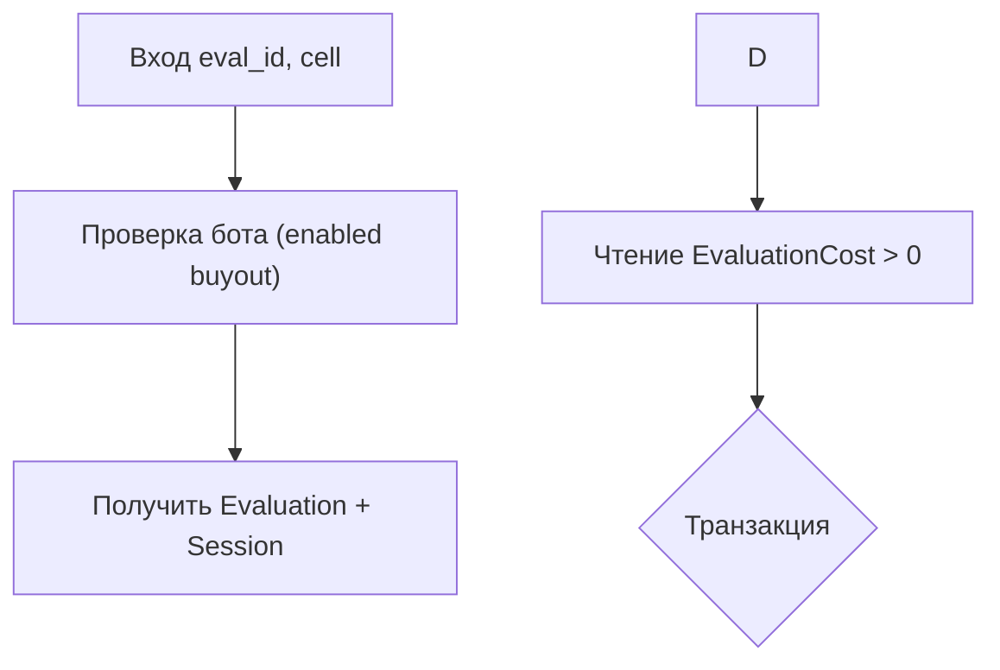

Правило для mermaid-диаграмм:

> **Во всех диаграммах mermaid весь текст внутри нод и условий всегда заключаем в двойные кавычки `"..."`.**

**Подробно:**

- Любые подписи нод (`A[...]`, `B(...)`, `{...}` и т.п.) **обязательно** пишем так:
    
    - `A["Текст ноды"]`
        
    - `B["Проверка бота (enabled buyout)"]`
        
    - `F{"Транзакция"}`
        
- Это особенно важно, если в тексте есть:
    
    - кириллица
        
    - пробелы
        
    - скобки `()`, `[]`, `{}`
        
    - знаки `>`, `<`, `=` и другие спецсимволы
        

**Рекомендуемый формат:**

(Опционально: в HTML-контекстах знак `>` лучше писать как `&gt;`, но кавычек обычно достаточно.)